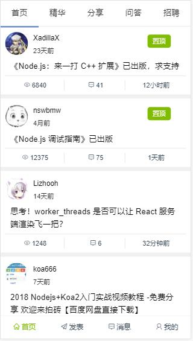
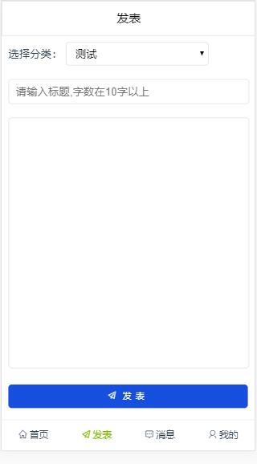
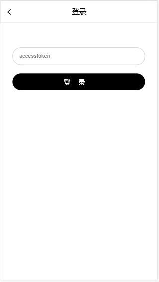
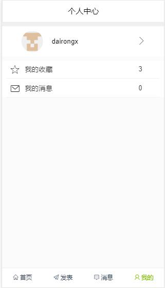

# cnode

> A Vue.js project

## 使用技术
- Vue
- Vue-router
- Vuex
- axios
## 页面截图
- 首页



- 主题详情


- 评论


- 发表



- 消息


- 登录



- 个人中心



- 用户信息


## 路由控制
``` js
router.beforeEach((to, from, next) => {
    if (to.meta.requireAuth) {           //判断该路由是否需要登录
        if (store.state.accesstoken === null) {
            next({
                path: '/login',
                query: {redirect: to.fullPath}
            })
        } else {
            next()
        }
    } else if (to.path === '/login' && store.state.accesstoken !== null) {
        let path = from.path     // 登录后不能进入登录页面
        next({
            path: path,
        })
    } else if (from.meta.scroll) {      // 记录滚动位置
        let element = document.querySelector('#scroll')
        let top = element ? element.scrollTop : '0'
        store.commit('scrollTop', top)
        next()
    } else {
        next()
    }
});
```

## 状态管理
登录后将信息存入sessionStorage中
``` js
    state: {
            animateType: '',
            accesstoken: window.sessionStorage.getItem('accesstoken') || null,
            loginName: window.sessionStorage.getItem('loginname') || null,
            avatar_url: window.sessionStorage.getItem('avatar_url') || null,
            user_id: window.sessionStorage.getItem('user_id') || null,
            scrollTop: 0
        }
```

## Build Setup

``` bash
# install dependencies
npm install

# serve with hot reload at localhost:8080
npm run dev

# build for production with minification
npm run build

# build for production and view the bundle analyzer report
npm run build --report
```
